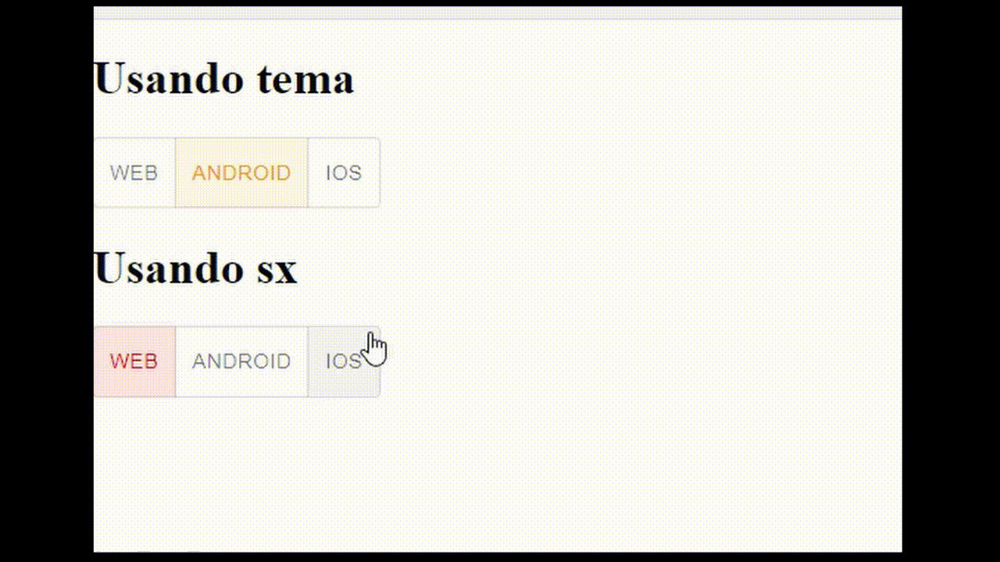

# MUI - toggle custom color

## Descrição

Demonstracão de como customizar as cores do toggle. Primeira forma usando tema e a segunda forma, usando sx.

## Tecnologias utilizadas

- [MUI](https://mui.com/pt/material-ui/getting-started/overview/)

## Comandos
### Instalar pacotes
```
yarn install
```
### Rodar localmente
```
yarn dev
```

## Demo

